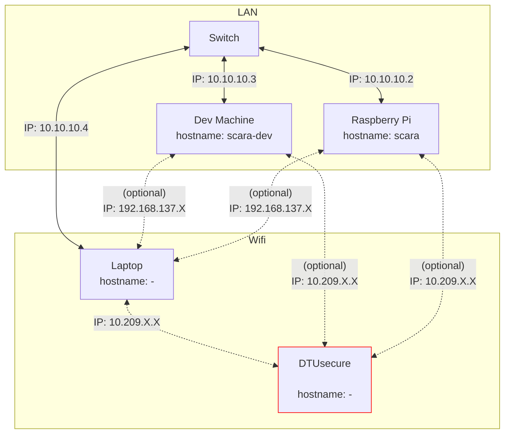

# Setup on the Raspberry Pi
> [!CAUTION]
>
> This list is under development and not complete (yet)

- Install Ubuntu Server 24.04 LTS
- Install openssh-server
- Run the scripts provided in [/scripts](scripts)

## Creating the boot image
Using the latest version of the [Raspberry Pi imager](https://www.raspberrypi.com/software/), flash an SD card (16GB, Class 10) with Ubuntu 24.04 LTS Server.
> [!IMPORTANT]
>
> Since the HDMI ports of the Raspberry Pi are no longer accessible when installed inside the robot, follow the next steps to configure remote access.
> Otherwise you would not even be able to see the shell of the OS.

Flash the SD card with the boot image, you dont need to set custom settings, this will be done in the next step.

When the flashing is finished, copy the [*network-config*](network-config) and [*user-data*](user-data) files to the boot/ partition of the SC card. The *network config* contains the initial netplan configuration. Setting the renderer to NetworkManager sets the WiFi managed by the NetworkManager and hence tools like the nmcli can be used. This file will only be read once per instance (during the first boot). The contents of *network-config* will be copied to */etc/netplan/50-cloud-init.yaml* [Link](https://docs.cloud-init.io/en/latest/reference/network-config-format-v2.html#netplan-passthrough).

The netplan contains the following configutation:
- Sets the Netplan renderer (the backend for which Netplan is creating the configuration files) to NetworkManager.
  - **NOTE**: For unknown reasons while testing theses instructions it has happened that the Pi was not connecting to the AP nor ethernet (and the credentials were 100%). Logging into the Pi with a screen attached showed that the NetworkManager was not installed on the system, this should not happen on a clean installation. If that should happed try one of the following:
    - Create a new boot SD card, but edit *network-config* to use 'networkd' (the systemd-networkd network service) instead of 'NetworkManager' as the Netplan rendered. The when booted up and connected to a network install the NetworkManager (`sudo apt install network-manager`). Edit */etc/netplan/50-cloud-init.yaml* back to 'NetworkManager' as renderer and apply `sudo netplan apply`. The network should now be up and managed by the NetworkManager, not systemd-networkd.
    - Instead of creating a new boot image, connect to the Pi's shell by attaching display and keyboard and change the renderer to 'networkd', apply 'sudo netplan apply', wait for connection `sudo netplan status -a`, then continue as described above with downloading the NetworkManager.
- Wifi:
  - Saves an AP with the SSID: 'DALSA_IOT' and pre-shared key: 'dalsa_iot'
  - This AP should be used as a fallback: The raspberry pi will try to connect to this AP if no other is available. You can then gain access to the Pi by creating an AP with the SSID and PSK with a router/laptop hotspot/phone hotspot. All methods should display the IP adrress of the Pi when it is connected.
- Ethernet:
  - Configures static routing for the eth0 interface for a LAN. Refer to the [Network Configuration](#network-configuration) diagram below.
  - The static IP of the robot (the Raspberry Pi) is set to 10.10.10.2.
  - The ethernet route gets assigned a higher metric to route internet traffic through the wifi interface if it is connected, since the LAN has not internet access.

The *user-data* file contains mostly configuration for the user *scara* with the password 'dtubio'. The ubuntu cloud-init program manages these configurations during instance deployment. Many settings can be set here, the README for reference:
>The user-data of the cloud-init seed. This can be used to customize numerous
aspects of the system upon first boot, from the default user, the default
password, whether or not SSH permits password authentication, import of SSH
keys, the keyboard layout, the system hostname, package installation, creation
of arbitrary files, etc. Numerous examples are included (mostly commented) in
the default user-data.
The format of this file is YAML, and is documented at:
https://cloudinit.readthedocs.io/en/latest/topics/modules.html
https://cloudinit.readthedocs.io/en/latest/topics/examples.html


## Network Configuration
The network architecure is as follows:


The Laptop is optional but usefull during development. In case a Windows hotspot is used the IP addresses are 192.168.137.X (Subnetmask 255.255.255.0).


### Static IP assignment
The */etc/netplan/50-cloud-init.yaml* should have the contents as the [*network-config*](network-config) file, the following snippet configrues the static IP address:
```yaml
...
  ethernets:
    eth0:
      addresses:
        - 10.10.10.2/24
      routes:
        - to: default
          via: 10.10.10.1
          metric: 700 # Increase the metric so that a the wifi connection (metric: 600) is prefered for internet traffic
      nameservers:
          addresses:
            - 8.8.8.8
            - 8.8.4.4
...
```
And the following a simple WPA wifi access point:
```yaml
...
  wifis:
    wlan0:
      dhcp4: true
      optional: true
      access-points:
        "<access-point-SSID>":
          password: "<access-point-psk>"
...
```
to apply changes to Netplan execute:
```bash
sudo netplan apply
```
### Connecting to DTUsecure
If the robot should be connected to DTUsecure, for example for a faster connection, run the provided [script](scripts/connect_DTUsecure.sh). DTUsecure uses the WPA-EAP authethication mechanism with your DTU id and DTU password. The script has been made to simplify the setup.
> [!CAUTION]
>
> Due the nature of the OS, your DTU accounts password will be saved in plain text in a netplan file on the system if the connection shall be saved persistently betweeen reboots! Follow the scripts output to see where.

To run the script first make it executable as follows:
```bash
cd ~/bioscara/Raspberry/scripts
sudo chmod +x connect_DTUsecure.sh
```
then the script can be run simply by invoking:
```bash
sudo ./connect_DTUsecure.sh
```
The script adds a connection via nmcli, and asks the user for DTU id and password and if the credentials should be saved.

### Further information about network management
Managing networks on Linux can be confusing, for example if interfaces show up as 'unmanaged' the chances are high that a different network manager has control over the interface. [This](https://wiki.archlinux.org/title/Network_configuration#Network_managers) table gives a good overview which programs might be involved.
Note that Netplan is not mentioned there, since Netplan only takes a standardized configuration file as input and then depending on the renderer creates the configuration for the backend. Currently Netplan only works with systemd-networkd and NetworkManager, the latter is much simpler to use with its CLI `nmcli`, and terminal UI `nmtui`. 

## Realtime Requirements
Both of the following settings were set to the best realtime performance after the installation of Ubuntu Server 24.04 LTS on the Raspberry Pi. This is how to check and change them if necessary.

This set of kernel configuration is also set when installing the "Low Latency Ubuntu" (`sudo apt install linux-lowlatency`)

### Preemption Policy 

In mainline Ubuntu the maximum preemption policy is PREEMPT. Check if set using:
Check if enabled if CONFIG_PREEMPT is set:
```bash
cat /boot/<BUILD?> | grep CONFIG_PREEMPT
```
last \<BUILD\> = config-6.8.0-1028-raspi

> PREEMPT_VOLUNTARY: This config option adds preemption points to the kernel, enabling voluntary interrupts of low-priority processes. By providing faster application responses with only slightly reduced throughput, CONFIG_PREEMPT_VOLUNTARY suits desktop environments.
>
> PREEMPT: Enabling CONFIG_PREEMPT reduces the kernel latency by making low-priority processes involuntarily preempt themselves. Preemption is disabled only at critical locations where the kernel must protect data from concurrency. Such config option fits embedded applications with latency requirements in the order of milliseconds. [source](https://ubuntu.com/blog/industrial-embedded-systems-ii)

### Interrupt Timer Resolution
> The timer interrupt handler interrupts the kernel at a rate set by the HZ constant. The frequency affects the timer resolutions as a 100 Hz value for the timer granularity will yield a max resolution of 10ms (1 Hz equating to 1000ms), 250Hz will result in 4ms, and 1000Hz in the best-case resolution of 1ms. [source](https://ubuntu.com/blog/industrial-embedded-systems-ii)

```bash
cat /boot/<BUILD?> | grep CONFIG_HZ
```
last \<BUILD\> = config-6.8.0-1028-raspi

### Adding the scara user to realtime group
Add the user to the realtime group and give it the rights to set higher scheduler priotities as described [here](https://control.ros.org/jazzy/doc/ros2_control/controller_manager/doc/userdoc.html#determinism)

| For real-time tasks, a priority range of 0 to 99 is expected, with higher numbers indicating higher priority. By default, users do not have permission to set such high priorities. To give the user such permissions, add a group named realtime and add the user controlling your robot to this group:

```bash
sudo addgroup realtime
sudo usermod -a -G realtime $(whoami)
```
| Afterwards, add the following limits to the realtime group in /etc/security/limits.conf:
```
@realtime soft rtprio 99
@realtime soft priority 99
@realtime soft memlock unlimited
@realtime hard rtprio 99
@realtime hard priority 99
@realtime hard memlock unlimited
```
| The limits will be applied after you log out and in again.

## Other Dependencies
The order of managing dependenices is according to [this](https://ros2-quality-assurance.readthedocs.io/en/released/tutorials/dependencies.html) guideline the following:
1. **rosdep**: Installs missing dependecies specified in the packages via the systems package manager.
2. **vcstool**: Specify further source code repositoryies in a repository file, vcstool will then retrieve the repository and it can then be built with colcon. 
3. **other**

### ROS2 dependencies
To install ROS2 package dependencies navigate to the workspace:
```bash
cd lib/ros2_ws
```

**First:**
Fetch all dependecies that are not available as binaries using the *vcstool*.
From the workspace execute:
```bash
vcs import --recursive src < req.repos
```
This will pull the repositories specified in *req.repos* into the directories also specified in the file.

> [!NOTE]
>
> *vcstool* is found in many ROS2 packages to import dependencies that are not in a ROS or debian repository from a repository file. 
>
> **Installation**:
>
> ```bash
> sudo apt install python3-vcstool
> ```


**Second:**

Install all packages that can be resolved through `rosdep` (all packages that have been released to the ROS2 package ecosystem and some debian packages):
```bash
sudo apt update
rosdep install --from-paths src --ignore-src -y --rosdistro $ROS_DISTRO
```
This command will recursively scan every package in the workspace for the `<depend/>` key and install missing packages.

Then dont forget to build the workspace:
```bash
sudo apt remove ros-$ROS_DISTRO-moveit*
rm -rf build/ install/ log/
MAKEFLAGS="-j1 -l1" colcon build --mixin release --executor sequential --symlink-install > log.out &
```

## Development Purposes:
### Install [PlotJuggler](https://github.com/facontidavide/PlotJuggler)
A very powerfull tool to to display data
```bash
sudo apt install ros-$ROS_DISTRO-plotjuggler-ros
```

### Install RQT tools
```bash
sudo apt install ros-jazzy-rqt*
```

### For debugging
```bash
sudo apt install xterm gdb gdbserver
```
