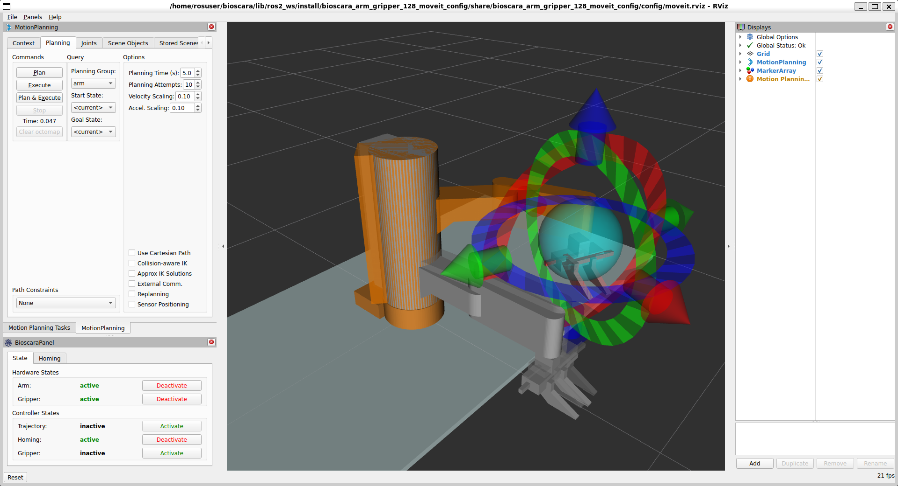
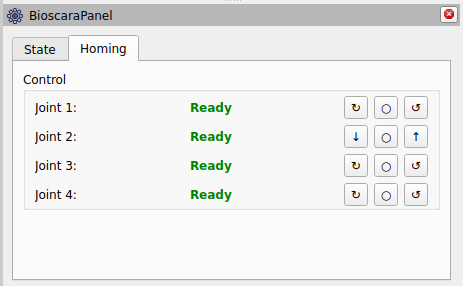
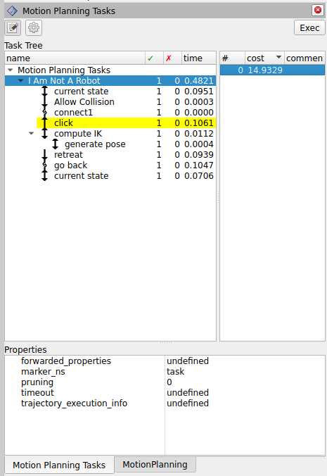
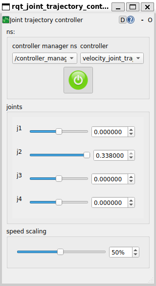

# Operate the Robot
This document explains how to bring the robot into operation for manual and programmatic control.
The document will decribe how to start the robot hardware as well as its emulation.

## Prerequisites
Make sure that following prerequisites are fullfilled:
- In order for the robot to operate, all software and system configurations must be installed as described in the [installation](installation.md) guide. 
- The ROS2 workspace must be compiled as described in the [build](building.md) guide.
- **For hardware operation:** The robot must be correctly assembled and all components are electrically connected.
<!-- TODO: link to assembly guide -->

## Starting the Robot

:::{warning}
You are about to enable the robot! Make sure it is securely mounted and its workspace is clear!
:::

Change to the *lib/ros2_ws* directory:
```bash
cd lib/ros2_ws
```
All following commands are relative to this directory.

Source the workspace packages:
```bash
source install/local_setup.bash
```

### Launch the complete Launch file
To start all ROS2 nodes simultaneously launch the complete launch file:
```bash
ros2 launch bioscara_arm_gripper_128_moveit_config complete.launch.py
```
This will start the ros2_control node responsible for the control implementation, the MoveIt2 move_group node for trajectory generation and RViz2 for viszualization including the custom Bioscara panel for hardware control.

:::{note}
With no access to the hardware it is possible to emulate it by passing the `use_mock_hardware:=true` argument to the launch file:
```bash
ros2 launch bioscara_arm_gripper_128_moveit_config complete.launch.py use_mock_hardware:=true
```
:::

### Alternative: Manually launching Nodes
If you experience problems with the complete launch file or to try differnent launch configurations, you can try to launch the components indiviudally.
First launch the ros2_control node with the *scene_bringup* packages:
```bash
ros2 launch scene_bringup bioscara_arm_gripper128.launch.py use_mock_hardware:=true/false
```

Then launch the move_group and rviz:
```bash
ros2 launch bioscara_arm_gripper_128_moveit_config move_group.launch.py
ros2 launch bioscara_arm_gripper_128_moveit_config moveit_rviz.launch.py
```

## Preparing the Robot
You should now see the RViz GUI like this



The important panel are on the left side. On the top left you can find the MoveIt *MotionPlanning* and MoveIt-Task-Constructor *Motion Plannining Tasks* Panel. But before we get to that the robot has to be configured for operation with the bottom left *Bioscara* Panel.

### Homing the Robot
If the robot has been power-cycled, its joint's need to be homed again. To do this activate the homing controller under the "State" tab as displayed in the picture above. The navigate to the "Homing" tab where you should see all joints as "Not Homed". During homing the joint will slowly drive towards its upper or lower limit where it will detect the collission and zero its encoder. You can select the direction through the buttons right of the joint label as it suits you best. Make sure that the joint can move freely and that it actually stops at its endstop. Repeat this until all joints report "Ready" as shown in the picture below:



### Enabling the Controllers
Now with the robot homed it is almost ready for operation. Under the "State" tab, deactivate the homing controller then activate the trajectory and gripper controller. The arm and gripper hardware must also be active. All joint motors are now engaged and can not be backdriven. To backdrive the robot deactivate the Arm hardware.

## Manually Create Trajectories
It is possible to manually plan trajectories, execute them, compare path planner performance and more with the *MotionPlanning* panel.
The [official tutorial](https://moveit.picknik.ai/main/doc/tutorials/quickstart_in_rviz/quickstart_in_rviz_tutorial.html) gives a good introduction hot to use it.

In short: Use the handles to move the orange goal robot state into a desired pose, then press "plan" and/or "execute" under the "Planning" tab. By default the OMPL RRTConnect path planner is used to plan the paths, alternatives can be selected under the "Context" tab.

### Planning Scene
Under the "Scene Objects" tab the planning scene can be modified. Collision objects can be added, modified and removed from it, or a a setup can be imported. Always press "publish" to commit the changes to the planning scene.

## Planning and Executing a MTC Task
The MoveIt-Task-Constructor is used to plan more complex trajectory sequences. The tasks are created in the *dalsa_motion_plans* package. Python scripts are the easiest to edit and create, although it seems that not all C++ methods are fully supported through the Python bindings. The Python scripts are in the *dalsa_motion_plans/scripts* directory.

### Adding a new MTC Task
A sort-of correct documentation for the Python bindings can be found [here](https://moveit.github.io/moveit_task_constructor/).
Using these recipes complex applications can be programmed. Some examples can be found in the */scripts* dir, have fun!

To create a new Python script with a new MTC task the following needs to be done:
- Create the *cool_task.py* under *dalsa_motion_plans/scripts*
- Add the script to the *dalsa_motion_plans/CMakeLists.txt*. Find the following lines and append the the *cool_task.py* to the list of installed files.
```cmake
install(PROGRAMS
        scripts/IAmNotARobot.py
        scripts/PickPlace.py
        scripts/PickPlace_continous.py
        scripts/PickPlace_markers.py
        scripts/cool_task.py                # <===== Append here
        DESTINATION lib/${PROJECT_NAME})
```
- In order to make the script available rebuild the *dalsa_motion_plans* package:
```bash
colcon build --symlink-install --mixin release --packages-select dalsa_motion_plans
```

### Executing the Task
From a new terminal, navigate to the *lib/ros2_ws* worspace and source it `source install/local_setup.bash`. Then you can execute any MTC task by invoking
```bash
ros2 launch dalsa_motion_plans run.launch.py exe:=cool_task.py
```
where the `exe` argument specifies the name of the script to execute.

If the task planned succesfully, it is published to the "/solution" topic and displayed in the *Motion Planning Tasks* MTC Panel shown below. For each task a number of solutions can be computed which can be indivdually inspected and, if one is selected, executed by pressing the Exec button.



## Common Problems
Some common issues and remedies are described in the following.

### Motion Planning Fails
This can have many reasons, the exact move_group error usually helps to identify the issue.
- **Start state out ouf bounds:** If a joint is just a tenth of a millimeter outside its limit, motion planning will fail. If the gripper is causing the violation, manually send a new width command through the console `ros2 action send_goal /gripper_controller/gripper_cmd control_msgs/action/ParallelGripperCommand "{command:{name:[gripper],position:[0.05]}}"`. If the problematic joint is on the robot arm and not J2, just deactivate the robot arm, move the joint away from the limit and reactivate the arm again. If the problematic joint is J2 it can not be moved by hand. Instead do the following: Open another terminal navigate to *lib/ros2_ws/*, source the workspace, and start the rqt_joint_trajectory_controller: `ros2 run rqt_joint_trajectory_controller rqt_joint_trajectory_controller`. Select the "controller_manager" and "velocity_joint_trajectory_controller", enable it on the red button and manually drag the J2 set point away from the limit. This GUI can also be used for other purposes but it should never be active in parallel with an ongoing trajectory through MoveIt.



- **Start state collision:** If a trajectory is planner immediatly after homing , the gripper links can be in a self-collision with link link_1, since the collision body is a primitive cylinder. Simply deactivate the arm and move the links out of collision. The collided links will be highlighted in red in RViz.

<!-- TODO: more problems? -->

### ros2_control Fails to Start
Sometimes, for yet unknown reasons, if the ros2_control node is launched from the complete launch file, it attempts to start the robot hardware despite the `use_mock_hardware:=true` has been set.
If that happens while no hardware is connected, the node will fail to start and control is impossible. Launching the ros2_control node separately as described in [here](#alternative-manually-launching-nodes) seems to resolve this issue.


<!-- TODO: where to modify dynamic limits -->