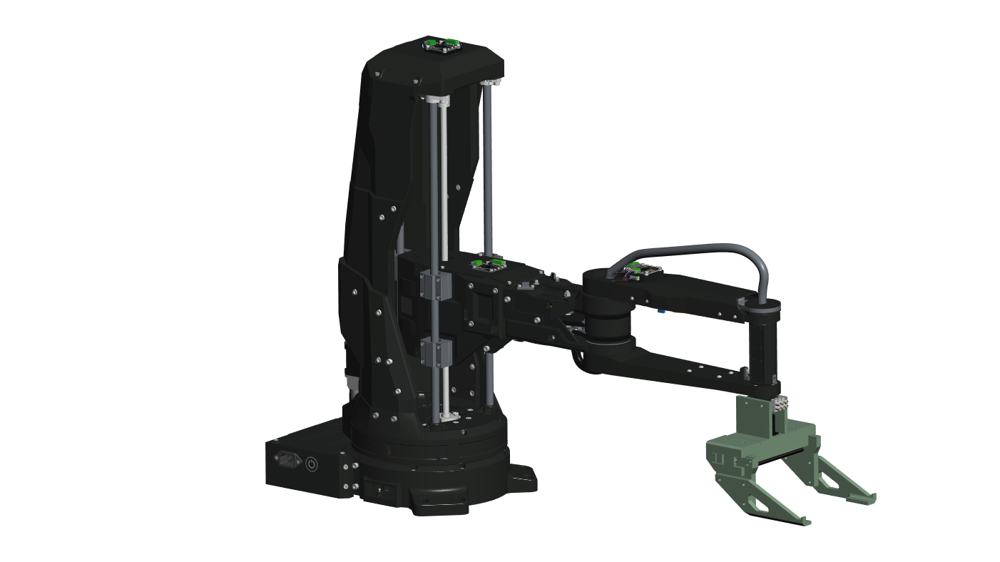
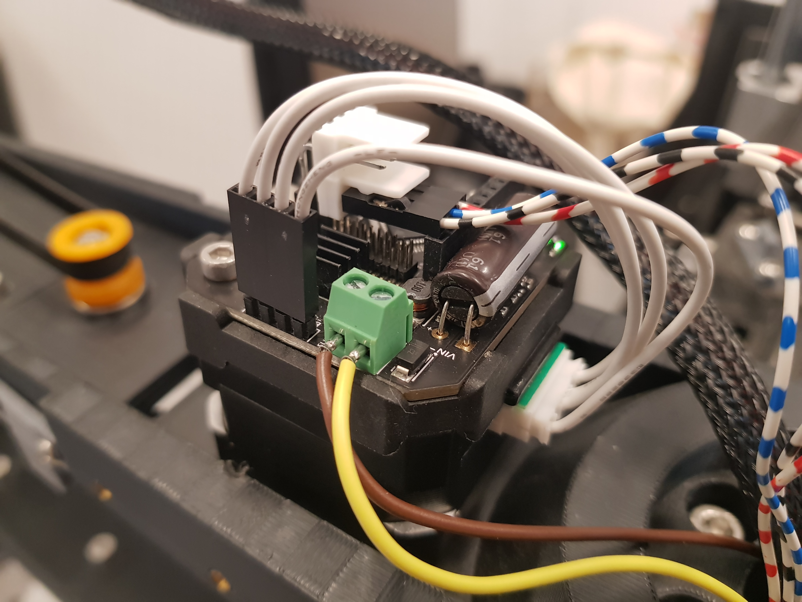
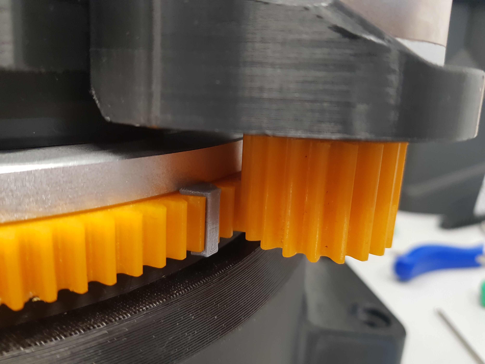
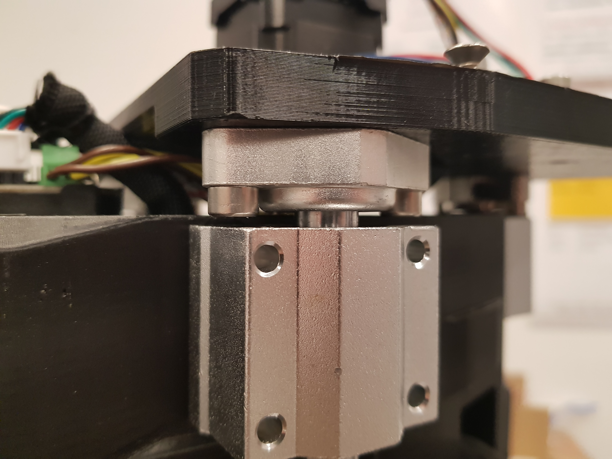
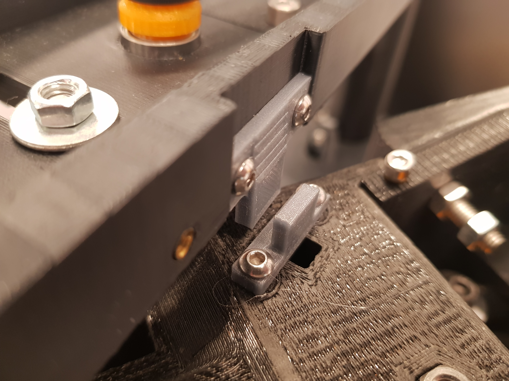
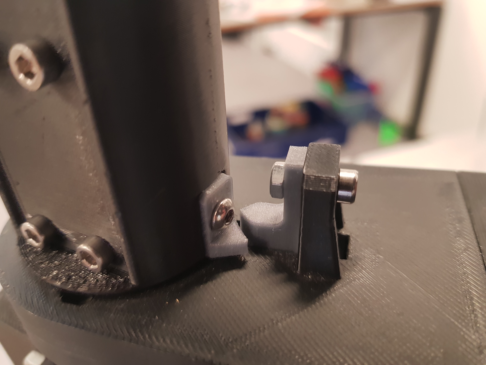
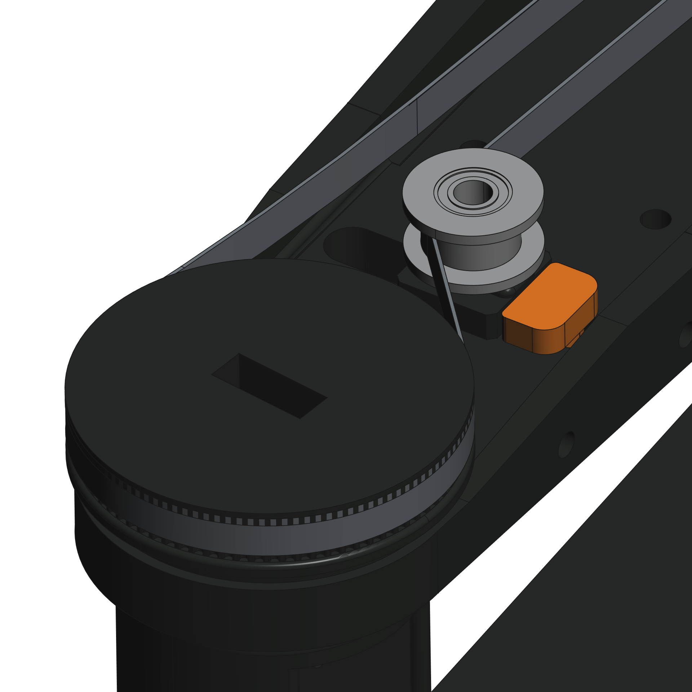
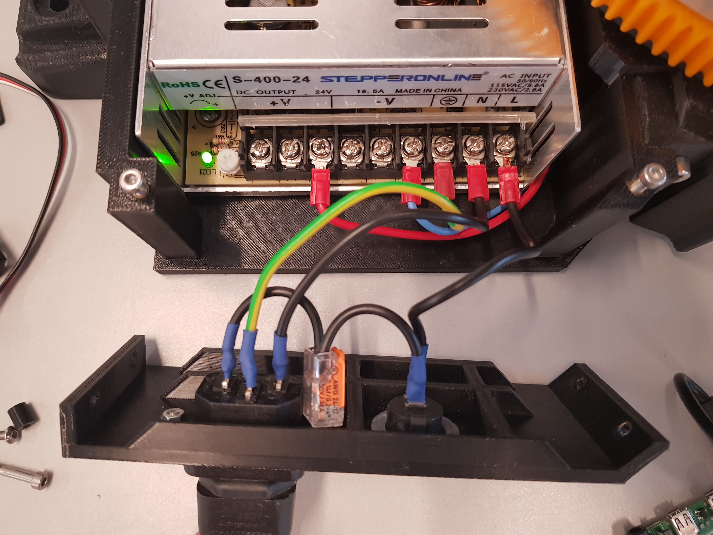
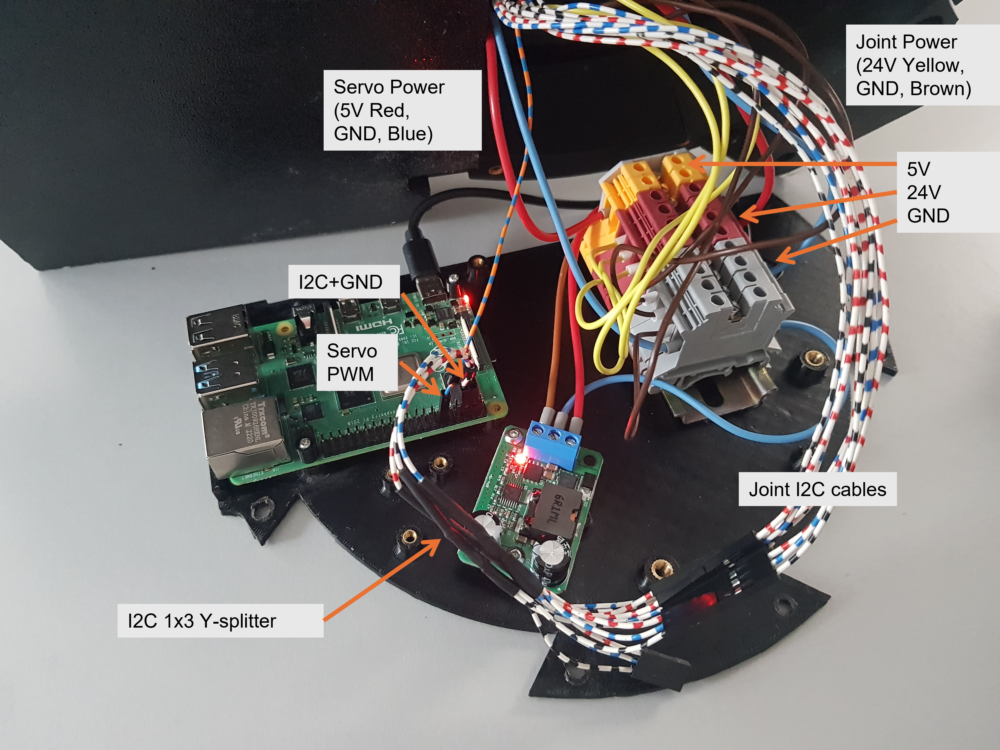

# Supplementary Assembly Instructions
The hardware has been modified in comparison the original Bioscara project.

## Key Modifications
The key changes were:
- Replacing the MKServo42C closed-loop stepper drivers with UStepper S32 drivers
- Removing the optical endstops and replacing them with physical stop blocks for sensor less homing
- Removing the associtated wiring to the optical endstops and MKServo drivers.
- The UStepper drivers only require two signal wires (SDA/SCL) and the 24V/GND power cables.
- The electronics compartment has been simplified since the 3D-printer motherboard could be removed.
- All wires have been replaced and properly sized and terminated.
- Power distribution is achieved through terminal block mounted on DIN-rails.
- The gripper has been redesgined.

### Joint driver
The new joint driver is mounted on the back of the stepper motors just like the MKServo 42C drivers. 

**TO-DO:**
- Increase the cutout dimensions in the J2 covers and J1 Top cover to make room for the slightly larger UStepper mounts.

### Endstops
See the new endstops in the figures below. Their STL file can be found in the *hardware/meshes/* directory.

|  |  |
|---|---|
| **J1 Endstop** | **J2 Endstop** |

|  |  |
|---|---|
| **J3 Endstop** | **J4 Endstop** |

### New Gripper Assembly
The new gripper was designed in June 2025. The results are presented in a [presentation](../../hardware/gripper_redesign_project_presentation.pdf) and [report](../../hardware/gripper_redesign_project_report.pdf).

The CAD files can be found under the *hardware/CAD Model/gripper_v2* directory.

### Tensioner Pulley Slipping
The J4 belt drive needs to be redesigned, since the tensioner pulley slips under load, releasing tension. The current workaround is the *tensioner_stop_block* that is inserted in the slot to prevent the pulley from sliding back. The stop block needs to be printed and inserted as shown in the figure. 

**TO-DO:**
- Fix the design, for example by "knurling" the surface to increase its roughness to increase friction.

### Electrical Design
The electrical schematic can be found [here](../../hardware/schematics/schematic.pdf).

The schematic shows how to wire the new joint controllers and how to distribute the power in the terminal blocks.
For indicative cable lengths and wire gauges refer to the schematic as well.

:::{important}
All wires shall be appropriatly sized and terminated with spade connectors for the power supply and ferrules for screw terminals.
:::

:::{note}
Some images may display a seperate GND connection with the I2C wires. This is no longer correct. The wiring as displayed in the schematic with only a single GND wired to the power terminals is correct.
:::

The AC wiring was redone. Note that the wires are properly terminated. The power switch was replaced with a simple switch.

### Simplified Electronics Compartment
The 3D-printer motherboard and level-shifter was removed from the base plate. The number of wires was reduced. The new design is shown in the figure below. 

**TO-DO:**
- Redesigning the electronics base plate to be able to properly mount all components. The terminal block are currently just glued in place.

## Assembly Instructions
The assmbley instructions are given in [this pdf](../../hardware/Bioscara_v2_manual_preliminary.pdf).

:::{tip}
A video of the original assembly can be found in [this  YouTube video](https://www.youtube.com/watch?v=obPP-tCtBTw).
:::

**TO-DO:**
- The instructions have only been preliminarily updated. A unified assembly guide with up to date images and information needs to be compiled.
- The current assembly guide is PowerPoint presentation. This file format is very poor for version control. The new assembly guide needs to full-fill the following criteria:
    - Platform independent: The new guide shall be easily maintainable from different platforms. PowerPoint is poorly portable between operating systems.
    - Version Control: The new guide shall be written in a text based format that supports version control such as this document or Latex.

## CAD Model and STL Meshes
The complete STEP CAD model can be found in the *hardware/CAD_model/* directory. The STEP file is compressed as a ZIP archive to be able to upload it to Github. The STL meshes for 3D-printing are in the *hardware/meshes/*.

:::{tip}
The original STEP files can be found [here](https://a360.co/3SWc07A)
:::

**TO-DO:**
- The coordinate systems of the CAD model are completely wrong and need to be fixed
- The CAD model does not include the simplified arm shape used in the robot description URDF files, this remains to be added.