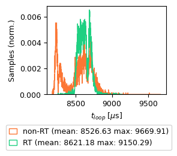
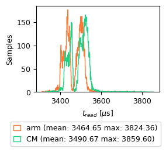
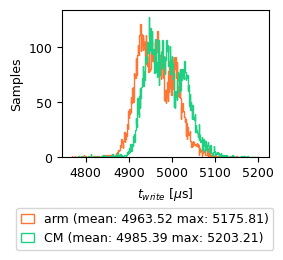
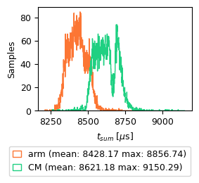

# Analyzing Realtime Performance of the Ubuntu Kernel
This test is to analyze the impact of kernel configurations on the execution times of the ros2_control main update loop. Missed deadlines could lead to poor controller performance.

## Approach:
Two test were conducted to evaluate the effect of the control loop's process priority on its execution time and periodicity during which the controller manager's diagnostic */controller_manager/statistics/* output was recorded. One test is conducted with the controller manager node with standard priority and the seocnd with RT priority.
By default the controller manager attempts to run the control loop with a RT priority of 50 and SCHED_FIFO, if it is lacking the rights for this, standard priority 20 and SCHED_OTHER is used. A description of the differeent schedulers and task priorities are given [here](https://man7.org/linux/man-pages/man7/sched.7.html) and [here](https://blogs.oracle.com/linux/post/task-priority).

### System Load:
The system is slightly loaded with the following ssh sessions (no X forwarding):
- ros2_control
- trajectory publisher
- ros2 bag recorder

A simple trajectory is published every 5s on the joint trajectory publisher test node:
```yaml
publisher_joint_trajectory_controller:
  ros__parameters:

    controller_name: "velocity_joint_trajectory_controller"
    wait_sec_between_publish: 15
    time_from_start: 10

    goal_names: ["pos1", "pos2"]
    pos1:
      positions: [-1.5707, 0.2, 0.0, 0.0]
    pos2:
      positions: [1.5707, 0.2, 0.0, 0.0]

    joints:
      - j1
      - j2
      - j3
      - j4

    check_starting_point: false
```
During a 10 minute period the robot executes a simple motion that alternates the J1, J3 and J4 position by 90°. The longer the test can run, the higher the chances to records an uncommon latency, the 10 minute period were chosen as a compromise

### Recording:
The controller manager publishes diagonstic telemetry about its update loop. The topics are recorded into a bag file:
```bash
ros2 bag record -e ^\/controller_manager.* -o record_<update_rate>_<prio>_<note>
```
Each test is conducted over 10 min, to increase the chance of uncommon latencies happening.

After the recording the bag file is replayed and saved to a CSV file:
```bash
ros2 bag play record_<update_rate>_<prio>_<note> -p
``` 
In another terminal listen and export topics to CSV:
```bash
ros2 topic echo /controller_manager/statistics/full --csv > record_<update_rate>_<prio>_<note>.csv
```

### ros2_control configuration
For each test the bioscara_arm hardware component, position_joint_trajectory_controller and joint_state_broadcaster are loaded and active. The controller manager is configured to run at 50 Hz -> 20 ms deadline. The assumption is that increasing scheduler priority shows effect by reducing the total control loop execution time.

## Test 1
The first test is conducted with the controller manager node running a non-realtime priority 20. The recording is 603 seconds long.

## Test 2
The second test is executed with the controller manager node with realtime priority 50 and FIFO Scheduler (default ros2_control values).
The user *scara* user has been added to the realtime group as described in the user manuals.

The recording is 613 seconds long.

## Results
The controller manager's total update loop execution time is the primary analyzed metric. A histogram of its distrbution in the non-RT and RT context is displayed in Figure 1. From the figure it is visible that the assumption of faster execution time is false. The only noticable change is that over the 10 min window the upper bound has decreased, indicating that the process has indeed received higher priority from the scheduler. On the other hand, the lower bound has also increased, for unclear reasons. The overall result is that the standard deviation has decreased.



**Figure 1:** Histogram of the total controller manager control loop in RT and non-RT context.


<table>
  <tr>
    <td><center><strong>Figure 2(a):</strong> Histogram of the exeuction time of the read-phase of the control loop. Split by the contribution from the bioscara_arm hardware interface and the total controller manager (CM) read duration.</td>
    <td><center><strong>Figure 2(b):</strong> Histogram of the exeuction time of the write-phase of the control loop. Split by the contribution from the bioscara_arm hardware interface and the total controller manager (CM) write duration.</td>
    <td><center><strong>Figure 2(b):</strong> Histogram of the total exeuction time of the control loop. Split by the contribution from the bioscara_arm hardware interface (sum of read+write) and the total controller manager (CM) cycle duration.</td>
  </tr>
</table>

## Observation
The plot in figure 1 disproves the assumption, the mean execution is unchanged between the tests, logically so because 8.6 ms is an order of magnitude away from the system latency which is usually at most a few hundred μs. The biggest effect is visible in the standard deviation which has reduced significantly from 187 μs to 75 μs, the lower priority process' wider spread indicates that it gets repeatedly preempted by other tasks, while the process run with RT priority gets prioritized, allowing it to finish in time.

## Discussion

The high mean execution time, far greater than system latency, indicates that there are other factors that throttle the control loop. This prompted a closer investigation of the data. Figure 2b displays another histogram, this time comparing the total loop time with just the sum of the read and write phase of the bioscara_arm hardware component during the same high priority test. The plot shows that the on average 97.8% of total execution time is spent in the hardware's read or write method. The remaining 193 μs are subsequently spent in the trajectory controllers and joint state broadcasters update phase. This insight led to yet another test described in the following section which reveals that the I2C communication is the bottleneck that slows down the control loop. This is also the reason why more controllers or even the gripper hardware component, which does not rely on I2C, would presumably have little impact on the test results. 