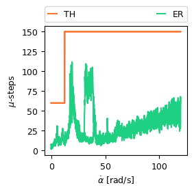
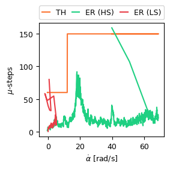

# High speed Stall Detection
This test is to examine the performance of the speed adaptive stall threshold.

> [!Note]
> All values are in motor units, not joint units!

## Test
For an unloaded joint motor, sweep the velocity setpoint slowly from 0 to 120 rad/s and back. The joint firmware prints all metrics of intererst in CSV format to the serial port from where they can be recorded into a file.

## Results
<table>
  <tr>
    <td>
<strong>Figure 1(a):</strong> Simple two level threshold</td>
    <td>
<strong>Figure 1(b):</strong> Simple two level threshold with a high speed and low speed stall</td>
  </tr>
</table>

## Development Notes
- Spikey PID error makes problems. First remove large spikes, then fast LP filter to remove remaining spikes of smaller amplitude. Needs to be fast in particular in low speed regime difficult to detect stall. 
- Two regimes with a breakpoint before the "resonance". Reason for systematic increase in PID error in speeds between 15 rad/s and 40 rad/s is unclear. Peak at higher speeds only appears when decelerating.
- Tuning the breakpoint might be necessary but it is difficult since all other joints cant move freely. 
- Threshold is set relatively high, making threshold linear to speed as well has little impact at high threshold values.
- High speed threshold leaves plenty of room. Also when stalling in highspeed regime threshold is pulled down.
- SG_RESULT did not indicate stall, further tuning would be necessary but it would also suffer from limited range.
